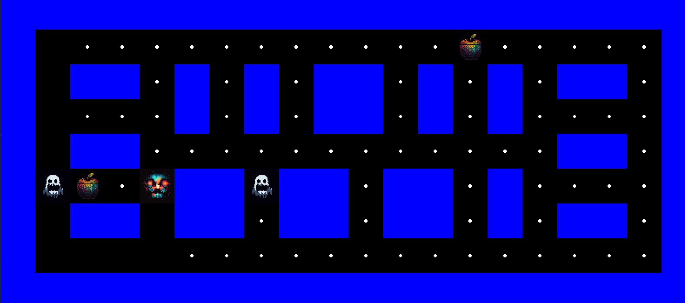

# Pacman-Pygame

Dieses Repository enthält den Python-Code für ein einfaches Pacman-Spiel, das mithilfe der Pygame-Bibliothek erstellt wurde. Es wurde als Teil eines YouTube-Tutorials erstellt, das auf [The Morpheus Tutorials](https://www.youtube.com/user/themorpheus407/) zu finden ist.



## Anforderungen

* Python 3.8 oder neuer
* Pygame 2.0.0 oder neuer

Sie können Pygame mit `pip` installieren:

```
pip install pygame
```

## Ausführen des Spiels

Führen Sie einfach die `main.py`-Datei aus:

```
python main.py
```

## Gameplay

* Steuern Sie Pacman mit den Pfeiltasten.
* Essen Sie alle Pellets, um das Spiel zu gewinnen.
* Vermeiden Sie Geister, es sei denn, Sie haben ein Power-Pellet gegessen. In diesem Fall können Sie Geister essen, um zusätzliche Punkte zu erhalten.

## Anpassungen

Sie können das Level ändern, indem Sie die `grid`-Variable in der `Level`-Klasse bearbeiten. Jedes Zeichen repräsentiert einen anderen Spielobjekt:

* `'W'`: Eine Wand
* `'P'`: Ein Pellet
* `'U'`: Ein Power-Pellet
* `'G'`: Ein Geist

## Fehlerberichte und Verbesserungen

Wenn Sie einen Fehler finden oder eine Verbesserung vorschlagen möchten, können Sie gerne einen Issue oder einen Pull Request erstellen.

## Lizenz

Dieses Projekt steht unter der MIT-Lizenz. Weitere Informationen finden Sie in der [LIZENZ](LICENSE)-Datei. 

## Youtube Tutorial

Für eine detaillierte Anleitung zur Entwicklung dieses Spiels besuchen Sie bitte den YouTube-Link: [Pacman Pygame Tutorial](https://www.youtube.com/user/themorpheus407/).

## Autor

* [The Morpheus Tutorials](https://www.youtube.com/user/themorpheus407/)
* [ChatGPT Thread 1](https://chat.openai.com/share/a86e367b-28c1-4293-8f7c-8eec79c80d59)
* [ChatGPT Thread 2](https://chat.openai.com/share/4f0fbbb7-6756-42a7-8345-c71dec94d2ab)

---

Danke, dass Sie sich unser Projekt angesehen haben. Viel Spaß beim Spielen!
